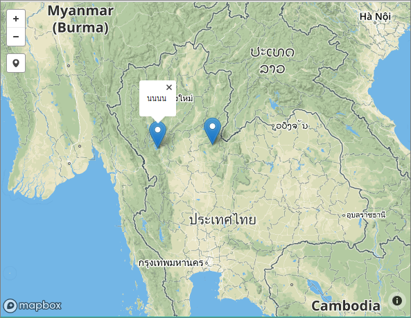

# NODEJS  POINT-CRUD Example

## About
```
ตัวอย่างการสร้างเวบจัดการข้อมูลพิกัดด้วย nodejs และ leafletjs
```



## Installation
```
# cd point-crud
# npm install
# restore gis_example.sql to mysql

```

## Mysql Configuration 
```
# config/db.json
```

## Test
```
# npm start
# browser:  http://localhost:3000


```


